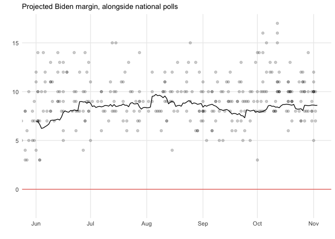

Toy US election simulator
================

This is nothing fancy. Just a simple election simulator based on
national and state-level polling. The code in this repo will generate
the graphs and statistics I shared here:
<https://twitter.com/gelliottmorris/status/1257331350618726400?s=20>

I hope this code well help shed some light on basic methods for
aggregating national and state polls, inferring electoral standings in
states without a lot of data and simulating what might happen in the
electoral college if polls lead us astray.

**None of this should be considered an official election forecast**,
this is just a fun exercise in coding and political statistics.

## Technical notes

The simulated error in this model is specified to capture the empirical
(IE historical) uncertainty in state-level polls fielded 200 days before
the election. It may not be well-calibrated to handle any additional
error from the regression model used to “fill in” averages in states
without any or many polls, so take it (and the rest of this exercise)
with a grain of
salt.

## Automated report:

The following maps and stats are updated periodically throughought the
day using [GitHub Actions](https://github.com/features/actions).

Last updated on **May 20, 2020 at 19:14 PM.**

### National polling average:

Joe Biden’s margin in national polls is
**5.6** percentage points. That is
different than his margin implied by the state-level polls and the
demographic regression, which is
**7.6** percentage points.

### State polling averages:

<!-- -->

### Tipping-point state

| State | Tipping point chance (%) | State | Tipping point chance (%) |
| :---- | -----------------------: | :---- | -----------------------: |
| FL    |                     16.9 | NM    |                      1.3 |
| TX    |                     10.8 | WA    |                      1.3 |
| PA    |                      9.6 | NJ    |                      1.1 |
| MI    |                      7.7 | OR    |                      1.0 |
| NC    |                      6.6 | IL    |                      0.9 |
| AZ    |                      5.6 | SC    |                      0.8 |
| OH    |                      5.4 | MO    |                      0.6 |
| WI    |                      4.9 | CT    |                      0.5 |
| VA    |                      4.5 | IN    |                      0.4 |
| GA    |                      4.4 | DE    |                      0.3 |
| MN    |                      3.9 | MS    |                      0.3 |
| NV    |                      3.4 | AK    |                      0.2 |
| CO    |                      2.0 | MT    |                      0.2 |
| IA    |                      2.0 | RI    |                      0.2 |
| ME    |                      1.6 | AL    |                      0.1 |
| NH    |                      1.3 | KS    |                      0.1 |

### Electoral college-popular vote divide

On average, the tipping point state is
**2.4** percentage points to the
**right** of the nation as a whole.
