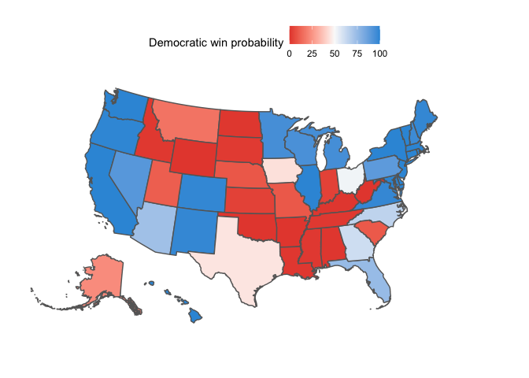
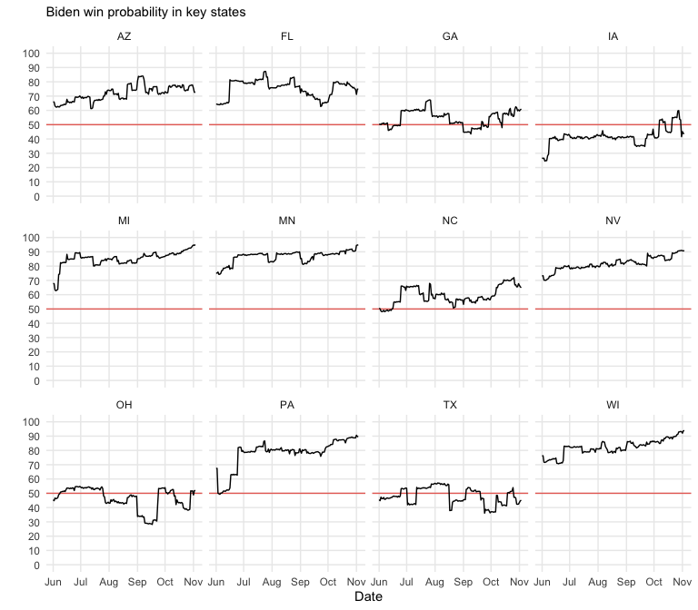
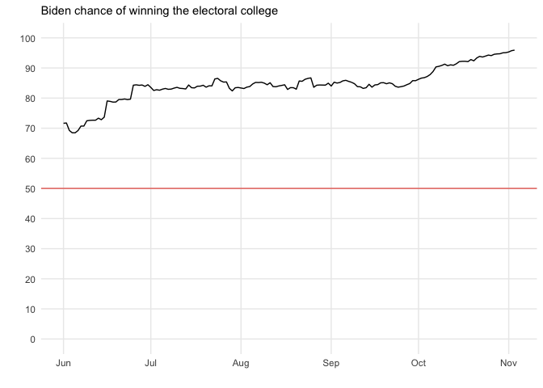

Toy US election simulator
================

G. Elliott Morris
[@gelliottmorris](https://www.twitter.com/gelliottmorris)

This is just a simple election simulator based on national and
state-level polls. The code in this repo will generate the graphs and
statistics I shared
[here](https://twitter.com/gelliottmorris/status/1257331350618726400?s=20).

My aim for this code is to help shed some light on basic methods for
aggregating national and state polls, inferring electoral standings in
states without a lot of data and simulating what might happen in the
electoral college if polls lead us astray. **None of this should be
considered an official election forecast**, or really even a good one. I
bet you’d have better-than-replacement-level rates of success with it,
but I only wrote it for a fun coding exercise and to show people how
this sort of program works—so act accordingly.

This caveat being addressed, I will concede that I do think this model
will provide us with some interesting material as the election cycle
progresses, so I’ve set up the model to update the maps and tables at
the bottom of this document throughout the day using [GitHub
Actions](https://github.com/features/actions). You can check back here
regularly to see how the race is changing.

## Technical notes

The file `scripts/main_poll_simulator.R` runs a series of models to
forecast the presidential election using national and state-level polls.
The first step is to average available polls fielded over the last two
months. That average is weighted by each poll’s sample size. If all
states had plenty of polls, this model would be easy; we would move on
to simulating many different “trial” elections by generating errors from
the appropriate distributions. Alas, not all states will be polled
adequately, so we turn to an intermediate step.

The second step is to predict what polls would say if pollsters surveyed
neglected states. We can regress Biden’s observed vote margin in each
state on a series of demographic variables in each. I use: Clinton’s
margin in the 2016 election; the share of adults who are black; the
share of adults with a bachelor’s degree or higher; the share of adults
who are Hispanic or another non-white, non-black race; the median age of
voters in a state; the share of adults who are white evangelicals; the
average number of people who live within five miles of any given
resident; the share of adults who are white and the share of adults who
are white without a college degree. Any regular statistical model would
struggle to avoid being over-fit by all these variables, so I use
[stepwise variable selection via
AIC](https://en.wikipedia.org/wiki/Stepwise_regression) and [elastic net
regularization](https://en.wikipedia.org/wiki/Elastic_net_regularization)
with a linear model trained using [leave-one-out
cross-validation](https://www.cs.cmu.edu/~schneide/tut5/node42.html). In
states with polls, the predictions from the regression model are given a
weight equal to that of a poll with an average sample size and averaged
with the raw polling data. In states without polls, the final “polling
average” is just the regression prediction.

Because polls are not perfect predictions of voting behavior, the final
step is to simulate many tens of thousands of different “trial”
election, in each one generating (a) national polling error, (b) a
regional polling error and (c) a state-level polling error. These errors
are disaggregated from the observed historical root-mean-square error of
election polls using a error sum-of-squares
[formula](https://fivethirtyeight.com/features/how-fivethirtyeight-calculates-pollster-ratings/)
that I cribbed from Nate Silver. This is equivalent to saying that
polling error is assumed to be correlated nationally and regionally, but
also have state-specific components that aren’t shared across
geographies. We could be more complex about this—–perhaps someone will
submit a pull request to generate correlated state-level errors using
`mvrnorm`, for example—but this works for my illustrative purposes here.

## Odds and ends

**A note on timing:** The simulated error in this model is specified to
capture the empirical (IE historical) uncertainty in state-level polls
fielded **200 days** before the election. It may not be well-calibrated
to handle any additional error from the regression model used to “fill
in” averages in states without any or many polls. So take it (and the
rest of this exercise) as an imperfect guide to the electoral
environment, rather than the best or most robust model we could think
of.

**A note on forecasting:** The reason this is a “toy” model is because
it does not attempt to project movement in the polls between whatever
day it runs and election day. Instead, it just treats the polls as
uncertain readings of the future, assuming no change in means. But this
is an empirically flawed assumption. We know from history that polls
during and after conventions tend to over-state the party that most
recently nominated a candidate. A true *forecasting* model will adjust
for these historical patterns and project that the favored candidate’s
election-day polling margin will be smaller than it is on the model run
date. This is yet another reason you should treat this analysis with a
hefty dose of skepticism—at least until election day…

**A note on polls:** The purpose of this analysis is to determine what
we know *now* from the polls. But polls often err in predicting
elections. It is probably better to combine general election polls with
other indicators of election outcomes, such as the state of the economy
or presidential approval ratings. Fancier election models will do so.
This is yet another reason not to squint at the estimates here.

**A final reminder: this is not an official election forecast.** The
purpose of this repo is to help people understand how these forecasts
work, and to provide some forecasters with code to improve their
methods.

With all that out of the way, I guess we can proceed…

## Automated report:

These graphs are updated hourly with new polls.

Last updated on **September 05, 2020 at 02:31 PM EDT.**

### National polling average and popular vote prediction

Joe Biden’s margin in national polls is
**8.9** percentage points.

His margin implied by state-level polls and the demographic regression
is **9.2** percentage points.

This chart draws a trend for Biden’s implied national margin and plots
individual national polls alongside it. His implied national margin will
not always match the raw average of national polls.

<!-- -->

### State polling averages

The polling average in each state:

In map form….

<!-- -->

In table form…

**The twenty most competitive states:**

| State | Biden margin, uncertainty interval (%) | State | Biden margin, … (%) |
| :---- | :------------------------------------- | :---- | :------------------ |
| NH    | 9 \[-4, 23\]                           | TX    | 0 \[-14, 14\]       |
| WI    | 8 \[-6, 22\]                           | GA    | \-1 \[-14, 13\]     |
| MI    | 8 \[-6, 22\]                           | OH    | \-2 \[-16, 12\]     |
| NV    | 7 \[-7, 21\]                           | AK    | \-2 \[-16, 12\]     |
| MN    | 7 \[-7, 21\]                           | MO    | \-5 \[-19, 9\]      |
| AZ    | 6 \[-8, 20\]                           | MT    | \-5 \[-19, 8\]      |
| PA    | 6 \[-8, 20\]                           | SC    | \-6 \[-19, 8\]      |
| FL    | 5 \[-9, 18\]                           | KS    | \-8 \[-22, 6\]      |
| NC    | 1 \[-12, 15\]                          | LA    | \-10 \[-24, 4\]     |
| IA    | 0 \[-14, 14\]                          | MS    | \-11 \[-24, 3\]     |

**The rest of the states:**

| State | Biden margin, uncertainty interval (%) | State | Biden margin, … (%) |
| :---- | :------------------------------------- | :---- | :------------------ |
| DC    | 78 \[64, 92\]                          | CO    | 11 \[-3, 25\]       |
| CA    | 35 \[21, 49\]                          | ME    | 11 \[-3, 25\]       |
| MA    | 33 \[19, 47\]                          | TN    | \-12 \[-26, 1\]     |
| HI    | 32 \[18, 46\]                          | NE    | \-13 \[-27, 1\]     |
| WA    | 31 \[17, 44\]                          | IN    | \-13 \[-27, 0\]     |
| VT    | 30 \[16, 44\]                          | AR    | \-15 \[-29, -1\]    |
| MD    | 26 \[12, 40\]                          | KY    | \-16 \[-29, -2\]    |
| NY    | 25 \[11, 39\]                          | SD    | \-16 \[-30, -2\]    |
| RI    | 21 \[7, 35\]                           | UT    | \-17 \[-31, -3\]    |
| IL    | 21 \[7, 35\]                           | ID    | \-19 \[-33, -5\]    |
| OR    | 20 \[6, 33\]                           | ND    | \-20 \[-33, -6\]    |
| CT    | 20 \[6, 33\]                           | AL    | \-20 \[-34, -6\]    |
| NJ    | 19 \[5, 33\]                           | OK    | \-21 \[-34, -7\]    |
| DE    | 17 \[3, 31\]                           | WV    | \-25 \[-39, -11\]   |
| NM    | 14 \[0, 28\]                           | WY    | \-29 \[-43, -15\]   |
| VA    | 13 \[-1, 26\]                          |       |                     |

### State polling averages, over time:

*(Just for key states.)*

<!-- -->

### State win probabilities

The odds that either candidate wins a state they’re favored in, given
the polling error:

In map form…

<!-- -->

### State win probabilities, over time:

*(Just for key states.)*

<!-- -->

### Tipping-point states

The states that give the winner their 270th electoral college vote, and
how often that happens:

| State | Tipping point chance (%) | State | Tipping point chance (%) |
| :---- | -----------------------: | :---- | -----------------------: |
| FL    |                     23.4 | ME    |                      1.1 |
| PA    |                     17.5 | VA    |                      1.0 |
| MI    |                     11.4 | IA    |                      0.5 |
| AZ    |                     11.3 | GA    |                      0.4 |
| MN    |                      9.8 | OH    |                      0.3 |
| WI    |                      8.0 | NM    |                      0.1 |
| NV    |                      5.2 | AK    |                      0.0 |
| TX    |                      2.9 | CT    |                      0.0 |
| NH    |                      2.6 | DE    |                      0.0 |
| CO    |                      2.4 | MO    |                      0.0 |
| NC    |                      2.2 | NJ    |                      0.0 |

### Electoral college outcomes

The range of electoral college outcomes:

<!-- -->

### Chance of winning the election, over time

<!-- -->

#### Chance of the popular vote winner losing the electoral college majority

The chance that one party wins the national popular vote, but loses the
electoral college majority:

|                                                                           | Chance (%) |
| :------------------------------------------------------------------------ | ---------: |
| Democrats win the popular vote and electoral college                      |         82 |
| Democrats win the popular vote, but Republicans win the electoral college |         10 |
| Republicans win the popular vote and electoral college                    |          8 |
| Republicans win the popular vote, but Democrats win the electoral college |          0 |

The probability the Democrats win the national popular vote is 92.1%.

#### The divide between the electoral college and popular vote

We can quantify either party’s edge as the average across simulations of
Joe Biden’s margin in the tipping-point state and his margin nationally:

On average, the tipping point state is
**3** percentage points to the
**right** of the nation as a whole.

### Changes in state averages relative to the national margin

This map shows where Biden and Trump have gained or lost ground since
2016, relative to their gains/losses nationally:

<!-- -->

# Endmatter

I hope you learned something. You can find me on Twitter at
[@gelliottmorris](https://www.twitter.com/gelliottmorris) or my personal
website at [gelliottmorris.com](https://www.gelliottmorris.com/).

This content is licensed with the [MIT license](LICENSE).
